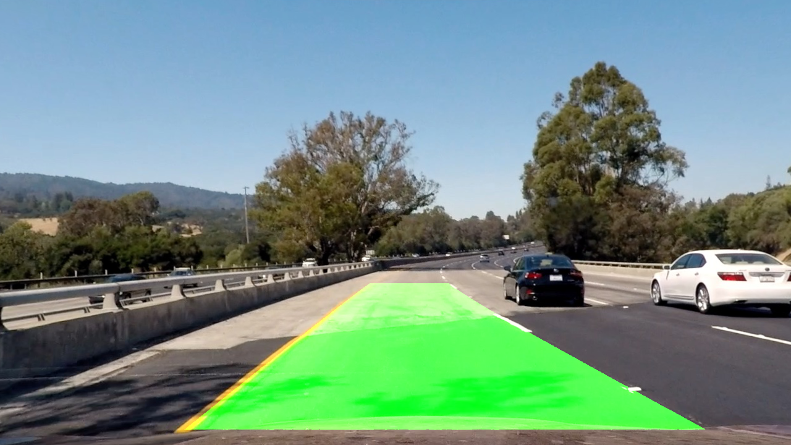
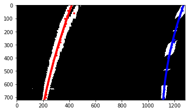

## Writeup Template

This project is MaxEtzo's submission for **Advancade Lane Lines** aassignment which is a part of [**Self-Driving Car Engineer Nanodegree's**](https://eu.udacity.com/course/self-driving-car-engineer-nanodegree--nd013) by **Udacity**

    
**Advanced Lane Finding Project**
The goals / steps of this project are the following:
* Compute the camera calibration matrix and distortion coefficients given a set of chessboard images.
* Apply a distortion correction to raw images.
* Use color transforms, gradients, etc., to create a thresholded binary image.
* Apply a perspective transform to rectify binary image ("birds-eye view").
* Detect lane pixels and fit to find the lane boundary.
* Determine the curvature of the lane and vehicle position with respect to center.
* Warp the detected lane boundaries back onto the original image.
* Output visual display of the lane boundaries and numerical estimation of lane curvature and vehicle position.

## [Rubric](https://review.udacity.com/#!/rubrics/571/view) Points

### Here I will consider the rubric points individually and describe how I addressed each point in my implementation.  

#### 1. Camera Calibation

First code cell of "sandbox.ipynb" contains camera calibration function `calibrate_cam()` that returns camera matrix and distortion coefficients. Calibration is performed with chessboard images located in the folder "./camera_cal/" with the following steps:
* chessboard corners of each image are detected with opencv's `findChessboardCorners` and stored to `imgpoints`
* `objpoints` are real-world coordinates. Here I assumed z = 0.
* camera matrix and distortion coefficients are estimated with opencv's `calibrateCamera` function
* an image can be corrected for distortion with opencv's `undistort` function

### Pipeline (single images)

#### 2. Correction for distortion 
First, image is corrected for distortion with opencv's `undistort` function using camera matrix and distortion coefficent estimated in previous step:

#### 3. Sobel, White and Yellow masking 

I find particularly efficient to use the following masks: **sobel, white,** and **yellow**. 
* **Sobel mask**'s purpose is to detect edge of lanes of any color. Sobel mask's is estimated based on both slope, to exclude horizontal edges, and magnitude. Sobel is applied on grayscale image with prior gaussian filtering to reduce noise.
* **White mask**'s purpose is obviously to detect white lanes. It is estimated based on S (<30) and V (>210) channels of HSV colorspace. Note that Hue is irrelevant for white, as saturation is low
* **Yellow mask**'s purpose is to detect yellow lanes. It is estimated based on H (15<H<30) and S (>100) channels of HSV colorspace.
Below the sobel, white and yellow masks for test image are represented in red, blue, and green respectively.

Final binary mask is a logical OR of all three masks, i.e.`(sobel | white | yellow)`. Code for masks located in first code cell of "sandbox.ipynb".

#### 4. Perspective transform

Perspective transform is applied to obtain "birds-eye view" on lanes. First, opencv's `getPerspectiveTransform` is used to calculate a transformation matrix. Transformation "anchor" points, source and destination, are hardcoded based on "./test_images/straight_lines2.jpg", i.e. it is assumed that lanes on the image are perfectly straight and parallel. Points are given in the table below

| Source        | Destination   | 
|:-------------:|:-------------:| 
| 254, 696      | 200, 720      | 
| 585, 458      | 200, 0        |
| 702, 458      | 1080, 0       |
| 1070, 696     | 1080, 720     |

Perspective transform is then applied to an individual image using opencv's `warpPerspective`.

#### 5. Peak detection (lane points) and polyfit

Lane points are detected on one-dimensional convolution values (see function `convolution1D` in code cell 5), i.e. convolution window is sliding across one dimension of the image. Start and end boundary for convolution for both left and right lane can be set based on the location of the previously found peaks (i.e. located lower in the image + margin). Simple `numpy.max` is used to identify peak. If multiple max's found the center location (via averaging) is taken as lane point. 

Self-implemented polyfit (code cell 7) is used to estimate a polynomial coefficient for left and right cell respectively

Curvature is estimated only in video pipeline as a method of `video_lane` class.

#### 6. Final result:

Estimated polynomial coefficients for left and right lane are passed to `generate_lane_img` function. Result is a lane image in birds-eye view. The lane image is warped back with inverse perspective transform matrix and added on top of original undistorted image (simple binary OR). Complete pipeline is implemented in function `draw_lane` in code cell 7.

Results for all test images can be found "/test_images_output" folder.

### Pipeline (video)

#### Difference to static image pipeline:
See code cell 10.
* Class `video_lane` is implemented to keep track of main variables across multiple frames
* Lane polynomial of a frame determine initial convolution boundaries for the next frame
* Lane polynomial is filtered with a decay factor for smoothness. Pseudocode: `poly_coeff[i] = measured_poly_coeff[i] * (1 - alpha) + poly_coeff[i-1]*alpha`
* Curvature and position are averaged across 5 frames and are updated every 5th frame respectively (for smoothness, otherwise values almost unreadable)

#### Final result:
Here's a [link to my video result](./project_video_output.mp4)

### Reflections:
Pipeline performs unsatisfactory on challenge videos. For example because of strong gradient in the middle of the road lane, that has nothing to do with lane markings. To avoid this, my suggestion is to remove sobel mask completely, and rely only on white and yellow masks. Another suggestion is to reject outliers when estimating polynomial coefficients for a more accurate results. And last but not least, implementing a some sort of confidence estimator will help improve accuracy substantially.  So that only a high confidence level lanes are taken into account, and if no such found then the lane for the frame is extrapolated based on the previous frames.
